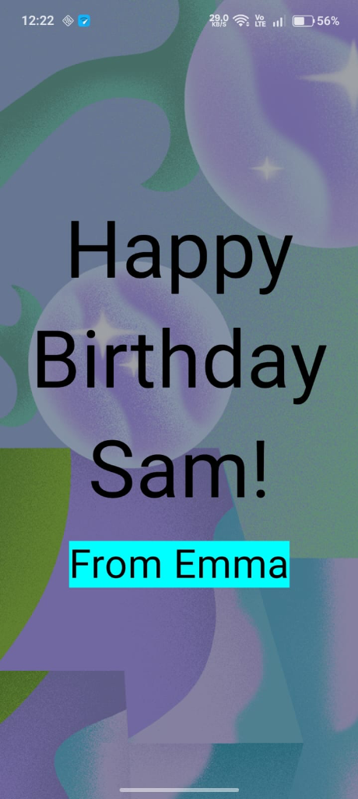
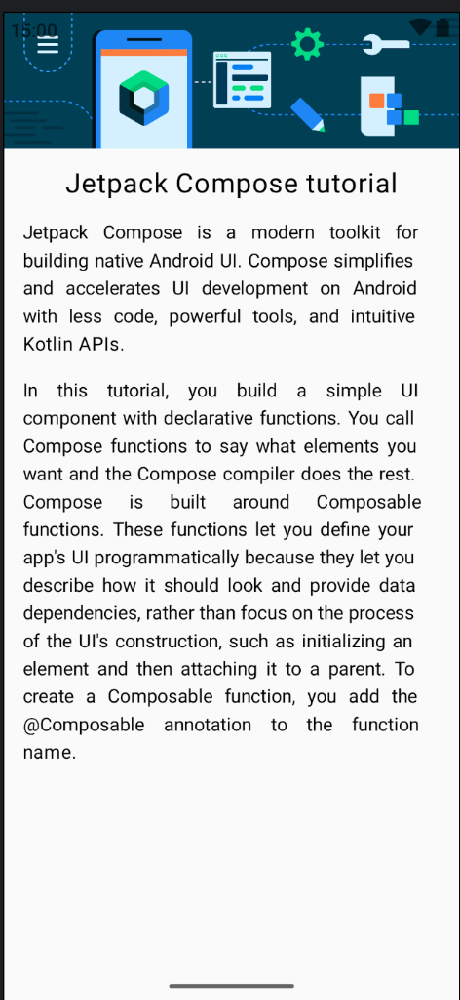
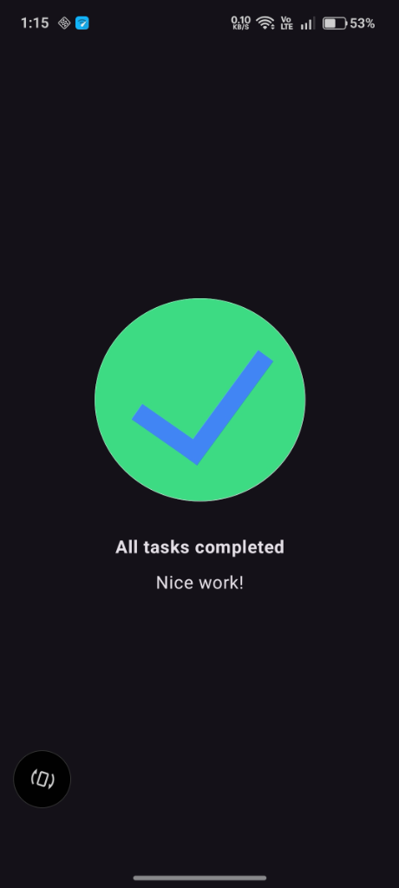
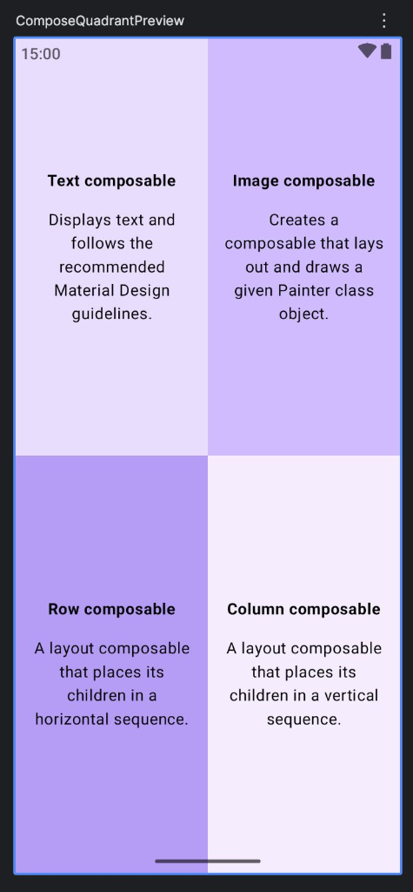
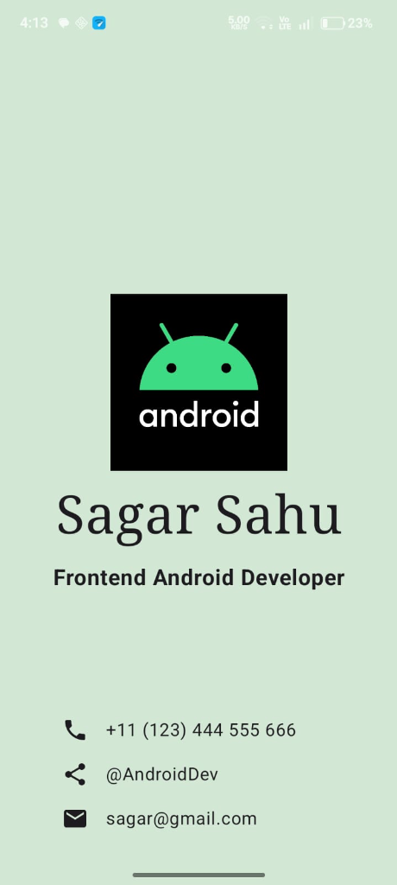

# 🎓 Jetpack Compose Basics — Practice Projects

A collection of beginner-friendly Android projects built with **Jetpack Compose** as part of the [Android Basics with Compose](https://developer.android.com/courses/android-basics-compose/course) course by Google. Each project focuses on mastering fundamental Compose concepts like layouts, text styling, image handling, and component composition.

---

## 📱 Projects

### 1. 🎂 Birthday Card

A vibrant birthday greeting card that displays a personalized message over a festive background image. Demonstrates image overlaying with `Box`, text styling with custom font sizes, and content scaling.

**Key Concepts:** `Box` layout, `Image` composable, `ContentScale.Crop`, alpha transparency, `stringResource`

<p align="center">
  
</p>

---

### 2. 📝 Compose Article (Tutorial)

An article-style screen that displays a Jetpack Compose tutorial with a banner image, heading, and justified body text. Practices vertical layout composition with `Column` and text alignment.

**Key Concepts:** `Column` layout, `Image` with `ContentScale.FillWidth`, justified text, padding modifiers

<p align="center">
  
</p>

---

### 3. ✅ Task Manager

A task completion screen featuring a centered checkmark icon with congratulatory text. Focuses on centering content both vertically and horizontally within a full-screen layout.

**Key Concepts:** `Column` with `Arrangement.Center`, `Image` composable, `FontWeight.Bold`, centered alignment

<p align="center">
  
</p>

---

### 4. 🟪 Compose Quadrant

A four-quadrant layout where each section describes a core Compose composable (Text, Image, Row, Column). Demonstrates equal-weight layout distribution using `Row` and `Column` with `Modifier.weight()`.

**Key Concepts:** `Row`/`Column` with `weight` modifier, custom background colors, `TextAlign.Justify`, reusable composable functions

<p align="center">
  
</p>

---

### 5. 💼 Business Card

A personal business card UI featuring a centered logo, name, job title, and contact information (phone, social handle, email). Practices combining `Box`, `Column`, and `Row` layouts with Material icons.

**Key Concepts:** `Box` with `Alignment`, Material `Icon` composables, `Row` layout for contact items, `FontFamily.Serif`, custom background color

<p align="center">
  
</p>

---

## 🏗️ Project Structure

```
app/src/main/java/com/example/birthdaycard/
├── Birthday.kt                        # Birthday greeting card
├── MainActivity.kt                    # App entry point
└── ui/theme/
    ├── BusinessCard.kt                # Business card UI
    ├── ComposeQuadrant.kt             # Four-quadrant layout
    ├── TaskManager.kt                 # Task completion screen
    ├── Tutorial.kt                    # Compose article/tutorial
    ├── Color.kt                       # Theme colors
    ├── Theme.kt                       # App theme configuration
    └── Type.kt                        # Typography definitions
```

---

## 🛠️ Tech Stack

| Technology | Details |
|---|---|
| **Language** | Kotlin |
| **UI Framework** | Jetpack Compose |
| **Design System** | Material Design 3 |
| **Min SDK** | 24 (Android 7.0) |
| **Target SDK** | 36 |
| **Build System** | Gradle (Kotlin DSL) |

---

## 🚀 Getting Started

### Prerequisites

- [Android Studio](https://developer.android.com/studio) (Ladybug or newer recommended)
- JDK 11 or higher
- Android SDK with API level 24+

### Run the Project

1. **Clone the repository**
   ```bash
   git clone https://github.com/Scorpio-4488/Happy_Birthday_App.git
   ```

2. **Open in Android Studio**
   - Open Android Studio → `File` → `Open` → select the cloned folder

3. **Build and Run**
   - Select an emulator or connected device
   - Click the ▶️ **Run** button or press `Shift + F10`

> **Note:** To switch between different project screens, update the `setContent` block in `MainActivity.kt` to call the desired composable function (e.g., `BusinessCardApp()`, `ComposeQuadrantScreen()`, etc.).

---

## 📚 What I Learned

- Building UI declaratively with **Jetpack Compose**
- Using **`Column`**, **`Row`**, and **`Box`** for layout composition
- Applying **modifiers** for padding, alignment, sizing, and background
- Working with **`Image`** composable and content scaling
- Utilizing **Material Design 3** components and icons
- Managing string resources with **`stringResource()`**
- Creating **reusable composable functions** with parameters
- Implementing **preview functions** with `@Preview` annotation

---

## 📄 License

This project is built for educational purposes as part of the [Android Basics with Compose](https://developer.android.com/courses/android-basics-compose/course) course.

---

<p align="center">
  Made with ❤️ by <strong>Sagar Sahu</strong>
</p>
